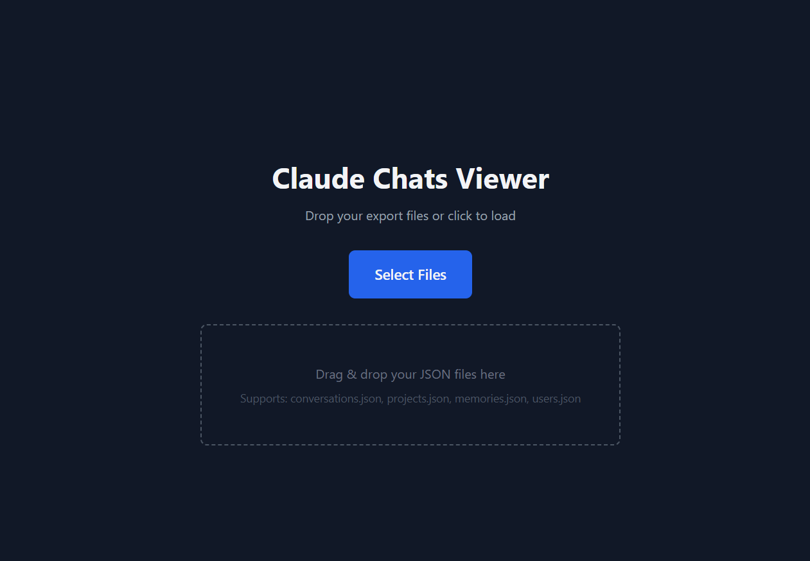
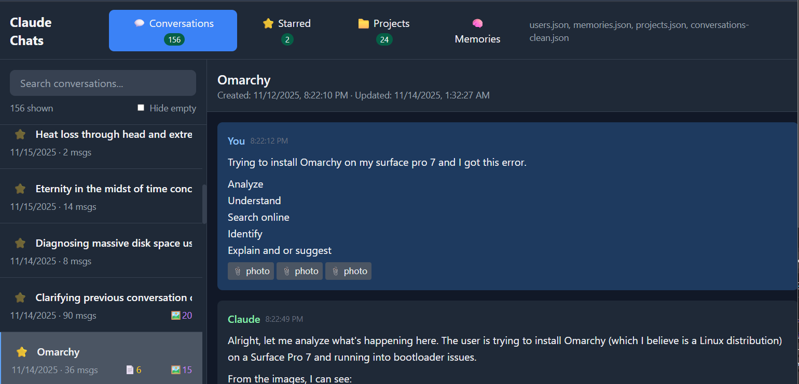

# Claude Chats Viewer

## Features

- **Conversations** — Browse all your chats with full markdown rendering and syntax highlighting
- **Starred** — Mark favorites with inline ⭐ toggle, persisted to localStorage
- **Projects** — View project details, system prompts, and associated documents
- **Memories** — See what Claude remembers about you (if exported)
- **Attachments** — Rendered/raw view toggle with download option
- **Search** — Filter conversations by title or message content
- **Dark mode** — Easy on the eyes

## Usage

1. Export your data from Claude (Settings → Account → Export Data)
2. Open `ClaudeChats.html` in any browser
3. Drag & drop your JSON files or click to select:
   - `conversations.json`
   - `projects.json` (optional)
   - `memories.json` (optional)
   - `users.json` (optional)

That's it. Everything runs client-side.

## Starring Conversations

Click the ⭐ next to any conversation to add it to your Starred list. Stars persist across sessions via localStorage.

## Keyboard Shortcuts

| Key | Action |
|-----|--------|
| `Esc` | Clear search filters |

## Requirements

- AI

## Privacy

All data stays local. Nothing is uploaded anywhere. The viewer loads CDN scripts for Tailwind CSS, Marked.js, and Highlight.js — that's it.

## License

MIT
